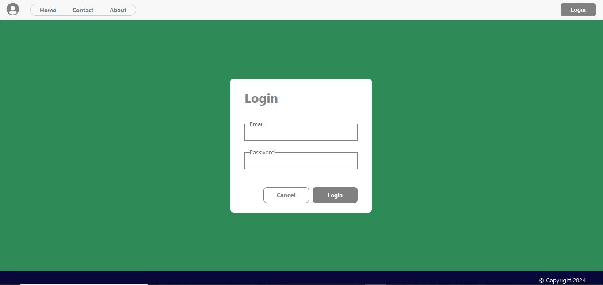
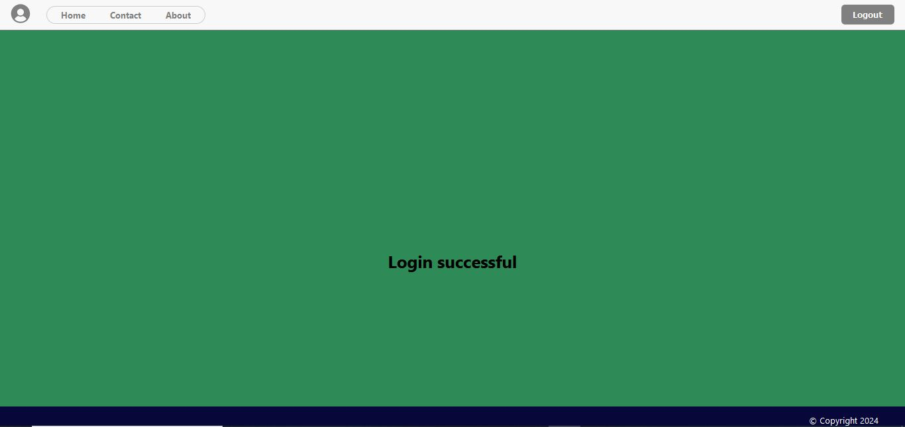
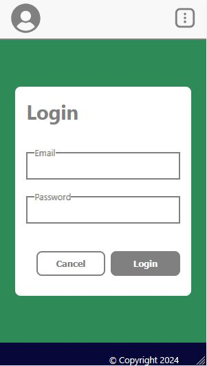
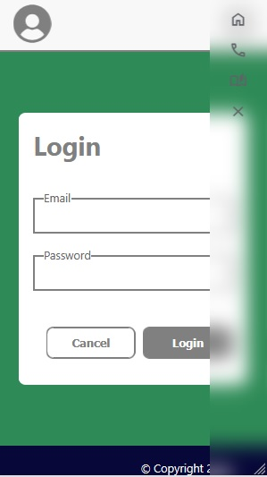
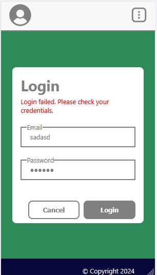
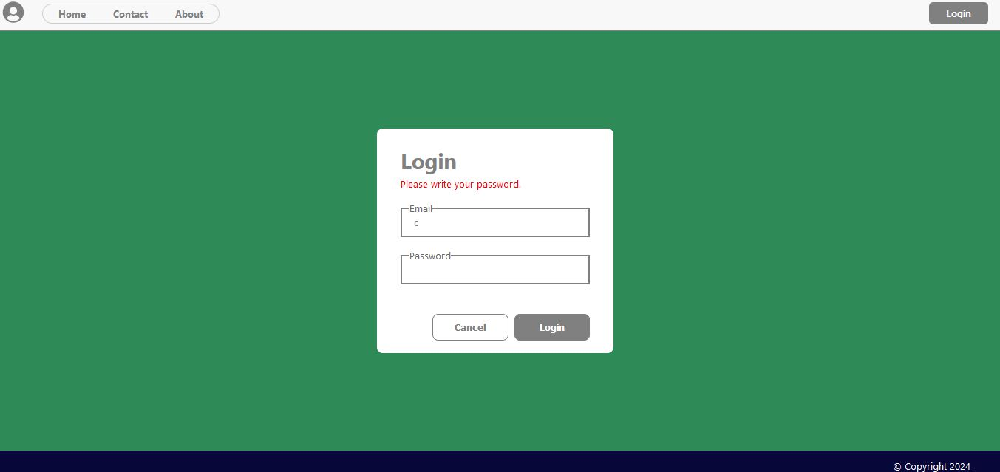
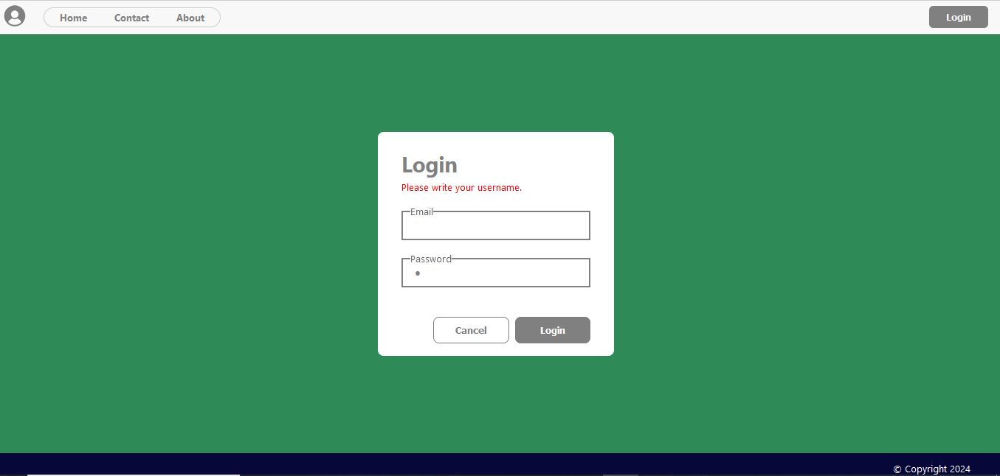

In the project directory, you can run:

### `npm start`

Runs the app in the development mode.\
Open [http://localhost:3000](http://localhost:3000) to view it in the browser.

The page will reload if you make edits.\
You will also see any lint errors in the console.

By opening the following link http://localhost:3000 the web page should be opened.

<p align="center">
  
</p>

You can login with the following user's credentials in users.json

```[
  {
    "id": 1,
    "username": "testuser1",
    "password": "password123"
  },
  {
    "id": 2,
    "username": "testuser2",
    "password": "password456"
  }
]
```
After a successful login you receive Login successful sign

<p align="center">
  
</p>

For fully functionality on all devices web page is responsible

<p align="center">
  
</p>
<p align="center">
  
</p>

When the username or password is incorrect the error appears also when there is not written of the input.

<p align="center">
  
</p>
<p align="center">
  
</p>
<p align="center">
  
</p>

Cancel button cleans the username, password and error if it appears in the login form.
